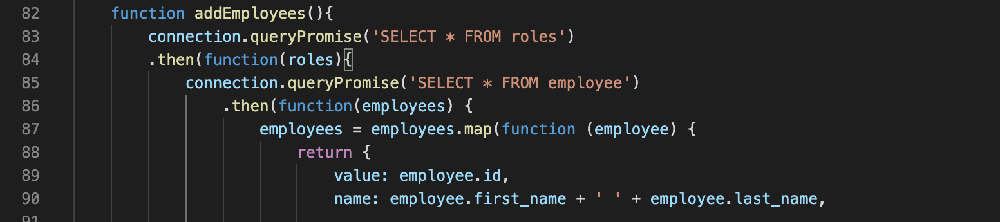

# Employee-Tracker


## Table of Content
- Objective
- Deploy Link
- Getting Started
- Code Highlights
- Technology
- Author 

## Objectives
Developers are often tasked with creating interfaces that make it easy for non-developers to view and interact with information stored in databases. Often these interfaces are known as Content Management Systems. In this homework assignment, your challenge is to architect and build a solution for managing a company's employees using node, inquirer, and MySQL.
The user will be prompted to answer a series of questions about which department, role and employee. 

## Deploy Link
https://github.com/ayladillis/Employee-Tracker

## Getting Started
These instructions will get you a copy of the project up and running on your local machine for development and testing purposes. See deployment for notes on how to deploy the project on a live system.

```
$ git clone git@github.com:ayladillis/Employee-Tracker.git
ayladillis/Employee-Tracker.git
$ cd ayladillis/Employee-Tracker.git
```
Then open in your preferred text editor:
- [vim](https://www.vim.org/) 
- [emmacs](https://www.gnu.org/software/emacs/)
- [visual studio code](https://code.visualstudio.com/) 

## Code Highlight
Here I used 'connection.queryPromise' to promisify and pull information from the roles and employee table.




## Technology
* [Javascript](https://developer.mozilla.org/en-US/docs/Web/JavaScrip)
* [Node.js](https://node.js.org/)
* [Inquirer](https://www.npmjs.com/package/inquirer)
* [MySQL](https://www.mysql.com/)
* [Console.table](https://developer.mozilla.org/en-US/docs/Web/API/Console/table)
* [Util](https://nodejs.org/api/util.html)


## Authors 
- [Ayla Dillis](https://github.com/ayladillis)
- [LinkedIn](https://www.linkedin.com/in/ayladillis/)
- [Portfolio](https://ayladillis.github.io/ayladillis_portfolio/)
- [Highlighted-Work](https://ayladillis.github.io/Coding-Bootcamp-Project-1-Zillow-Maps-API-AD/)
- email: aayladillis@gmail.com